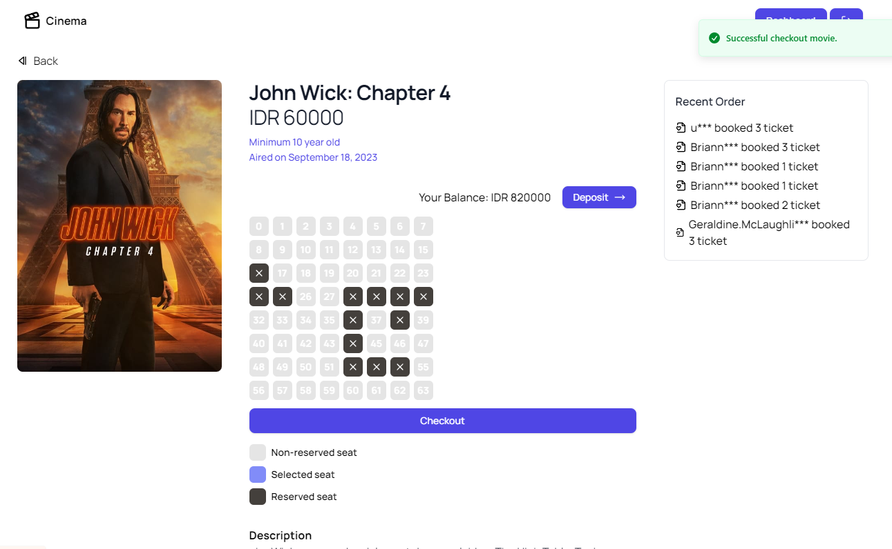

# [Cinema](https://cn.recrav.com/)

This is a Simple Booking Cinema App created using NextJS 13.4 + Server Action, Prisma ORM + Supabase, and Tailwind CSS. It was bootstrapped with [`create-next-app`](https://github.com/vercel/next.js/tree/canary/packages/create-next-app).

[]([https://cn.recrav.com/])

> **Warning**
> Project is made based on Compfest 15 SEA candidate.
> 
> This project is still in development and is not ready for production use.

## Tech Stack

- [Next.js](https://nextjs.org) + Server action
- [Next Auth](https://next-auth.js.org)
- [Prisma ORM](https://prisma.io)
- [Tailwind CSS](https://tailwindcss.com)
- [Supabase](https://supabase.com)
- [Faker JS](https://fakerjs.dev/)

## Features

- Basic Credentials authentication using next-auth
- Checkout seat feature
- Manual deposit and withdrawal
- Cancel order ability
- User under movie age cannot booked ticket
- Randomize username using faker-js

## To Do

- [ ] Add payment gateway (Midtrans/Xendit) to deposit testing
- [ ] Code Refactoring
- [ ] Configure UI more beautiful & responsive

## Installation

### 1. Clone the repository

```bash
git clone https://github.com/raymondtju/cinema
```

### 2. Install dependencies

```bash
pnpm install
```

### 3. Create a `.env` file

Create a `.env` file in the root directory and add the environment variables as shown in the `.env.example` file.

### 4. Run the application

```bash
npm run dev
```

## Deploy on Vercel

The easiest way to deploy your Next.js app is to use the [Vercel Platform](https://vercel.com/new?utm_medium=default-template&filter=next.js&utm_source=create-next-app&utm_campaign=create-next-app-readme) from the creators of Next.js.

Check out our [Next.js deployment documentation](https://nextjs.org/docs/deployment) for more details.
